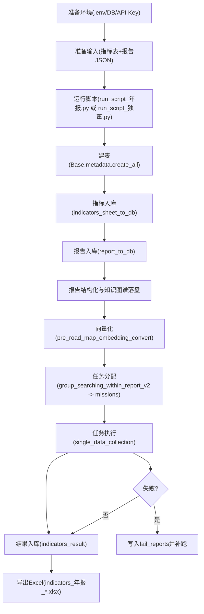

# zsx_独立董事指标跑批 - 项目说明文档

## 1. 项目简介
本项目用于批量处理上市公司年报/独立董事述职报告 JSON，完成以下核心目标：

1. 将报告结构化内容入库（MySQL + SQLAlchemy）。
2. 为报告文本/表格与指标关键词生成向量。
3. 按指标体系自动检索证据、分配任务、调用大模型问答。
4. 产出 `indicators_result` 指标结果表，并导出为 Excel。

该仓库以“跑批脚本 + 业务模块”方式组织，主入口是：

- `run_script_年报.py`：年报指标跑批。
- `run_script_独董.py`：独立董事述职报告指标跑批。

## 2. 目录结构与职责

### 2.1 顶层关键目录
- `logic_folder/`：核心业务逻辑（检索、问答、表格处理、ORM 模型）。
- `operation_folder/`：业务操作流水（文件入库、指标入库、指标批量收集）。
- `ian_evolution/`：LLM 客户端管理与 API 封装。
- `模块工具/`：工具层（API 调用、语义增强、OCR/报告 JSON 处理等）。
- `uploads/`：指标表、名单等输入文件。
- `downloads/`、`downloads_0630_下午_年报/`：知识图谱 JSON 中间产物。
- `output/`、`output_year_report/`：结果 Excel 与统计脚本。
- `测试/`、`独立董事报告pdf/`、`年报json/`：测试数据/样本数据目录。

### 2.2 关键文件
- `run_script_年报.py`：年报全流程（建表 -> 指标入库 -> 报告入库 -> 向量化 -> 任务分发 -> 指标收集 -> 导出 Excel）。
- `run_script_独董.py`：独董全流程（与年报类似，但输入过滤与任务执行层级更多）。
- `logic_folder/数据库表格.py`：所有核心 ORM 模型定义。
- `operation_folder/文件录入.py`：报告 JSON 预处理、知识图谱存储、库表写入。
- `operation_folder/指标表录入.py`：指标体系入库与关键词向量化。
- `operation_folder/指标批量收集.py`：单指标/批量指标的问答与结果入库。
- `logic_folder/语义增强包.py`：指标词语分类、关键词拆分、单字过滤等大模型增强逻辑。
- `ian_evolution/client_manager.py`：各大模型客户端初始化（Qwen/DeepSeek/Minimax/SiliconFlow）。

## 3. 技术栈
- Python 3.10+（建议与历史运行环境保持一致）。
- MySQL + PyMySQL。
- SQLAlchemy ORM。
- pandas（Excel 读写与数据清洗）。
- OpenAI 兼容接口（主要通过 DashScope/Qwen）。
- 并发执行：`ProcessPoolExecutor`。

## 4. 数据库核心模型（简版）
模型定义位于 `logic_folder/数据库表格.py`，主要表如下：

- `company`：公司主数据。
- `reports`：报告元信息（公司、年份、入库状态、person_name 等）。
- `sections` / `sentences` / `charts` / `headers` / `key_index` / `table_value` / `description`：报告结构化内容。
- `vector`：文本、表格、指标关键词等向量。
- `indicators`：指标定义与配置（类型、关键词、规则、任务层级等）。
- `indicators_result`：最终结果（value/reference/table_reference/original_answer）。
- `missions`：待执行任务队列。
- `fail_reports`：失败记录。
- `statistic`：调用成本统计。

## 5. 环境变量配置
项目通过 `.env` 读取配置。建议使用无空格、无多余引号的写法：

```env
DB_HOST=localhost
DB_PORT=3306
DB_USERNAME=root
DB_PASSWORD=your_password
DB_NAME=your_database

DASHSCOPE_API_KEY=sk-xxxx
DEEPSEEK_API_KEY=sk-xxxx
MINIMAX_API_KEY=xxxx
SILICONFLOW_API_KEY=sk-xxxx
```

注意：
- `run_script_年报.py` 会在脚本开头强制覆盖 `DB_NAME` 为 `zsx_年报指标跑批_0617`。
- `run_script_独董.py` 默认使用 `.env` 中 `DB_NAME`。

## 6. 运行流程说明

### 6.0 总览流程图


### 6.1 年报流程（`run_script_年报.py`）
核心阶段：

1. 设置数据库名并建表。
2. 读取指标 Excel，执行 `indicators_sheet_to_db`。
3. 遍历输入名单，匹配 `测试/` 下报告 JSON，调用 `report_to_db` 入库。
4. 执行 `pre_road_map_embedding_convert` 完成向量化。
5. 依据报告和指标生成 `missions`。
6. 并发执行 `single_data_collection` 写入 `indicators_result`。
7. 从数据库导出结果到带时间戳的 Excel。

运行示例：

```bash
cd /Users/linxuanxuan/Desktop/zsx_独立董事指标跑批
python3 run_script_年报.py
```

### 6.2 独董流程（`run_script_独董.py`）
与年报主链路相似，差异点：

1. 使用独董名单与任职周期筛选。
2. 任务执行分 `execute_level == 1` 与 `execute_level == 2` 两层。
3. 对 `report_name + person_name` 的任务按批次分组执行。

运行示例：

```bash
cd /Users/linxuanxuan/Desktop/zsx_独立董事指标跑批
python3 run_script_独董.py
```

## 7. 输入输出约定

### 7.1 典型输入
- `uploads/指标表/...xlsx`：指标体系表、公司-人员名单。
- `测试/` 或 `0616独立董事述职报告json/`：报告 JSON 文件。

### 7.2 典型输出
- 数据库表：`indicators_result`、`fail_reports`、`missions` 等。
- Excel 导出：`indicators_年报_<DB_NAME>_<timestamp>.xlsx`。
- 中间产物：`downloads_0630_下午_年报/<类型>/知识图谱_*.json`。

## 8. 关键配置点（高频改动）
脚本中存在较多硬编码路径，迁移环境时要重点检查：

- `run_script_年报.py` 中 `root_folder`、`df_file`、`indicator_file`。
- `run_script_独董.py` 中 `root_folder`、`df_file`、`indicator_file`、筛选逻辑。
- `operation_folder/文件录入.py` 中 `folder = 'downloads_0630_下午_年报'`。

建议把以上路径抽取为配置项（`.env` 或 `yaml`），避免改代码才能换批次。

## 9. 常见问题与排障

### 9.1 报错 `401 invalid_api_key`
症状：日志出现 `Incorrect API key provided`，随后关键词生成/嵌入失败并产生连锁告警。

排查：
1. 检查 `.env` 的 `DASHSCOPE_API_KEY` 是否有效。
2. 确认运行脚本使用的 Python 环境与 `.env` 所在目录一致。
3. 验证 `ian_evolution/client_manager.py` 的 `qwen_client` 读取的是期望变量。

### 9.2 日志里出现 `{}`
常见来源：
- `operation_folder/指标表录入.py` 中函数返回 `True, {}`。
- 关键词抽取失败时，`weight_keywords` 回退为字符串 `'{}'`。

这通常是“空结果占位”，不是独立异常。

### 9.3 任务跑不全/部分跳过
常见原因：
- 名单中的 `company_code/person_name` 在 `root_folder` 找不到匹配 JSON 文件。
- `db_report_name` 为空时会被跳过。
- `report.in_db != 1` 导致后续收集未执行。

### 9.4 数据库连接问题
- 检查 `DB_HOST/PORT/USERNAME/PASSWORD`。
- 检查连接数上限与长事务。
- 并发较高时可调小 `ProcessPoolExecutor(max_workers=...)`。

## 10. 开发与维护建议

1. 将硬编码文件路径、年份、批次名统一配置化。
2. 对 `401`、`429`、超时增加“快速失败 + 明确错误提示”，减少无效重试。
3. 把“指标入库/报告入库/任务执行/导出”拆成可单独运行的 CLI 子命令。
4. 为关键函数增加最小回归测试（至少覆盖：关键词生成失败、mission 执行失败、导出成功）。
5. 增加一个 `requirements.txt`，固定依赖版本，降低环境漂移问题。

## 11. 快速上手检查清单
运行前建议逐项确认：

1. `.env` 中 DB 与 API Key 正确。
2. MySQL 实例可连通，目标库有权限创建/写入。
3. 输入 Excel 路径、报告 JSON 路径存在。
4. `run_script_*.py` 中年份与本次批次一致。
5. 先小样本（如 10-50 条）试跑再全量。

---
如果要继续完善，我建议下一步补两份文档：

1. `docs/字段字典.md`：对 `indicators_result` 各字段含义和取值规范做统一定义。
2. `docs/运行手册.md`：按“日常跑批/补跑/失败重试/结果对账”给出标准操作流程。
# -
