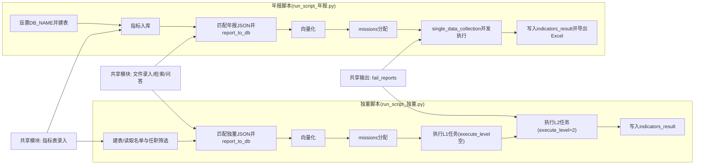

# 快速上手（30分钟）

## 1. 目标
用最短时间把项目跑通一次，并拿到可核对的 `indicators_result` 结果。

## 1.1 双泳道流程图（年报 vs 独董）


## 2. 运行前准备（5分钟）

### 2.1 进入项目目录
```bash
cd /Users/linxuanxuan/Desktop/zsx_独立董事指标跑批
```

### 2.2 检查 `.env`
至少确认以下字段可用：

```env
DB_HOST=localhost
DB_PORT=3306
DB_USERNAME=root
DB_PASSWORD=你的密码
DB_NAME=你的数据库

DASHSCOPE_API_KEY=你的有效key
DEEPSEEK_API_KEY=你的key
MINIMAX_API_KEY=你的key
SILICONFLOW_API_KEY=你的key
```

注意：
- 推荐去掉等号两侧空格和引号，避免读取异常。
- `run_script_年报.py` 会覆盖 `DB_NAME`，以脚本内设置为准。

### 2.3 准备输入文件
确认这些路径存在（按你本次跑批实际情况改）：
- 名单/指标表：`uploads/指标表/*.xlsx`
- 报告 JSON：`测试/` 或 `0616独立董事述职报告json/`

## 3. 先做小样本试跑（10-15分钟）

### 3.1 建议先跑年报脚本
```bash
python3 run_script_年报.py
```

### 3.2 小样本策略（强烈建议）
在脚本里临时限制行数，例如：
```python
df = pd.read_excel(df_file)
df = df.head(10)
```

先确认链路完整，再放大到全量。

### 3.3 你会看到的关键阶段
1. 创建库表。
2. 指标入库。
3. 报告入库。
4. 向量化。
5. 任务分配（missions）。
6. 指标收集并写入 `indicators_result`。
7. 导出 Excel。

## 4. 结果验收（5分钟）

### 4.1 检查是否有导出文件
年报脚本会在项目根目录生成类似文件：
- `indicators_年报_<DB_NAME>_<timestamp>.xlsx`

### 4.2 检查数据库结果
重点看 `indicators_result`：
- 是否有本次公司和人员的数据。
- `value/reference/table_reference` 是否有内容。

### 4.3 快速判断是否“跑通”
满足以下三点即可判定跑通：
1. 无大面积报错中断。
2. `indicators_result` 有新增记录。
3. 成功导出 Excel。

## 5. 常见问题（快速定位）

### 5.1 `401 invalid_api_key`
原因：`DASHSCOPE_API_KEY` 无效或未正确加载。  
处理：更换有效 key，重新跑小样本确认。

### 5.2 日志里出现 `{}`
通常是默认空结果占位（例如关键词生成失败回退），不是独立崩溃错误。  
先看是否伴随 `401` 或 `None` warning。

### 5.3 任务数明显偏少
常见是报告文件没匹配上：
- `company_code/person_name` 与文件名规则不一致。
- `db_report_name` 为空导致跳过。

### 5.4 数据库连接异常
- 检查 `.env` 的 DB 配置。
- 检查 MySQL 服务是否启动。
- 降低并发 `max_workers` 再试。

## 6. 从小样本切到全量

1. 去掉 `head(10)` 限制。  
2. 再次运行同一脚本。  
3. 观察失败记录（`fail_reports`），对失败对象单独补跑。

## 7. 推荐日常操作顺序
1. 先更新 `.env` 和输入路径。  
2. 小样本试跑。  
3. 核对数据库与导出文件。  
4. 再全量跑批。  
5. 最后做缺失统计与补跑。
